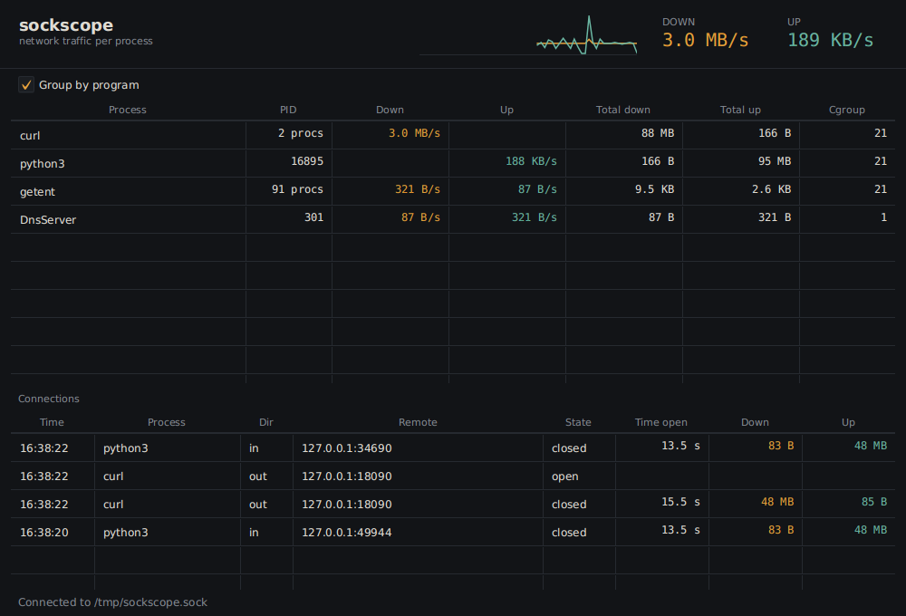

# sockscope

Live network traffic per process on Linux, counted in the kernel with eBPF.

A small collector attaches to the kernel's TCP and UDP send and receive paths
and adds up bytes per process. It also reports every TCP connection as it opens
and closes. A JavaFX window shows who is downloading and uploading right now,
a one-minute graph, and the connections of the program you pick.



## How it works

- kprobes on `tcp_sendmsg`, `tcp_cleanup_rbuf`, `udp_sendmsg`, `udp_recvmsg`
  and their IPv6 versions count bytes per process in a BPF hash map.
- The `sock:inet_sock_set_state` tracepoint reports TCP connections opening and
  closing, with addresses, ports, duration and bytes. Incoming connections are
  credited to the process that called `accept()`, found with a kretprobe on
  `inet_csk_accept`.
- Only counters, addresses and process metadata are collected. Packet contents
  are never read.
- The collector reads the map once a second and publishes one JSON line per
  sample, either to stdout or to a Unix socket.
- The viewer is a separate process and runs as a normal user. Only the
  collector needs privileges.

```json
{"t":1790087939,"procs":[{"pid":8100,"comm":"curl","cgroup":21,"tx":83,"rx":2000205,"txTotal":83,"rxTotal":2000205}]}
```

`tx` and `rx` are bytes in the last interval, the totals are since the
collector started. `cgroup` is the cgroup id, which tells containers apart.
Connections arrive as separate lines:

```json
{"t":1790091275,"conn":{"kind":"close","dir":"in","pid":16649,"comm":"python3","cgroup":21,"local":"127.0.0.1","lport":18095,"remote":"127.0.0.1","rport":54916,"ms":2,"rx":84,"tx":300205}}
```

## Requirements

- Linux 5.8 or newer with BTF (`/sys/kernel/btf/vmlinux` exists). WSL2 works.
- Root, or `CAP_BPF` and `CAP_PERFMON`, for the collector.
- clang, libbpf headers, bpftool and Go to build the collector.
- Java 21 for the viewer.

On Ubuntu:

```
sudo apt install clang llvm libbpf-dev bpftool golang-go openjdk-21-jdk
```

## Build

```
cd collector
go generate ./...
go build -o sockscope-collector .

cd ../app
./gradlew installDist
```

## Run

Print samples to the terminal:

```
sudo ./collector/sockscope-collector
```

Or serve them on a socket and open the viewer:

```
sudo ./collector/sockscope-collector -socket /run/sockscope.sock -group "$(id -gn)" &
app/build/install/sockscope/bin/sockscope
```

The socket is readable by root and the given group. The viewer looks for
`/run/sockscope.sock` unless `SOCKSCOPE_SOCKET` points somewhere else, and
reconnects if the collector restarts.

## Limits

- Upload is counted when a program hands data to the kernel. A program that
  writes a large buffer in one call shows up as a burst, then as idle while the
  kernel sends it. Totals are exact.
- Download is counted when the program reads the data, so it is smooth.
- Only TCP connections are listed. UDP traffic is counted but has no connection
  to show.

## Next

- Host names for remote addresses.
- TCP retransmits per process.
- Container and pod names instead of cgroup ids.
- `.deb` and `.rpm` packages with a systemd unit for the collector.

## License

MIT. The eBPF program is dual BSD/GPL, which the kernel requires for the
helpers it uses.
